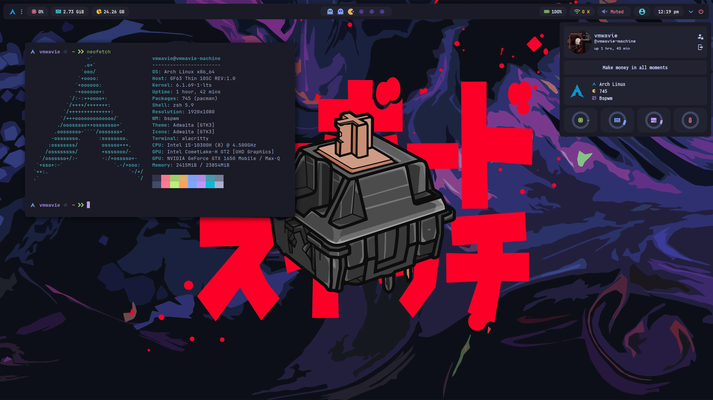

# DOTFILES
#### This dotfiles can be used as a post-install for your archlinux. In addition to the setup files for bspwm, it also has an installer for some programming tools and environments.

### Preview :


## 🚀 Optional Tools :
	[android_sdk]
		android-studio
		jdk17-openjdk
		
	[react]
		npm
		yarn
		nvm
		typescript
		
	[flutter]
		flutter
	
	[php]
		php 7.2 (php72-fpm)
		nginx
		php-xdebug

	[nodejs]
		nodejs
		npm
		yarn
		nvm
		postman
		
## 📃 Default Tools :
	alacritty, lvim, google-chrome, visual-studio-code, paru
	
## 📦 setup

```sh
	sudo pacman -S git && git clone https://github.com/vmwavie/dotfiles.git && cd dotfiles && chmod +x install.sh && ./install.sh
```